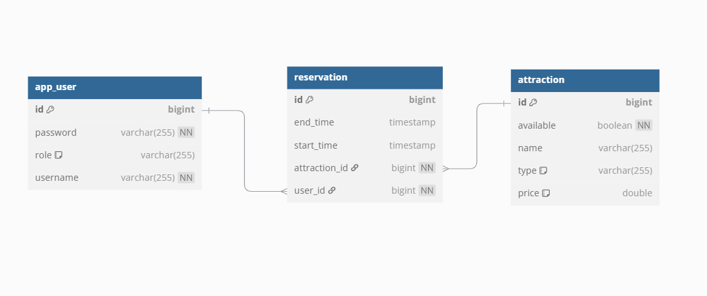
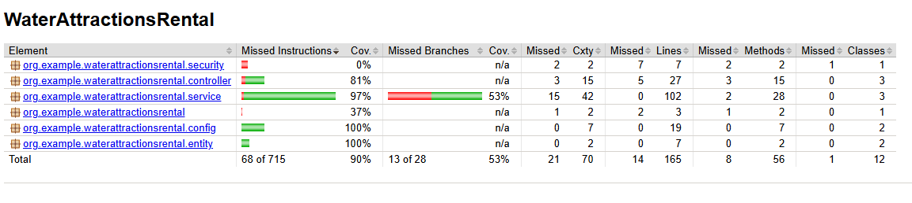

# WaterAttractionsRental


## Opis projektu

**WaterAttractionsRental** to aplikacja do zarządzania wypożyczalnią atrakcji wodnych (np. kajaków, skuterów wodnych, rowerów wodnych). System umożliwia rejestrację, logowanie, rezerwację sprzętu, zarządzanie użytkownikami, flotą oraz kontrolę dostępów dzięki autoryzacji (RBAC).  
Projekt spełnia wymagania formalne z zakresu obiektowości, SOLID, wzorców projektowych oraz jest w pełni konteneryzowany (Docker).

---

## Technologie

- **Java 17+**  
- **Spring Boot** (Web, Data JPA, Security, Springdoc OpenAPI)  
- **Hibernate** (ORM)  
- **PostgreSQL** (Docker)  
- **Maven** (zarządzanie projektem i zależnościami)  
- **Docker / Docker Compose**  
- **Testy:** JUnit 5, Mockito  
- **Pokrycie testów:** JaCoCo  
- **Swagger UI** (dokumentacja API)

---

## Uruchomienie aplikacji (Docker)

1. **Zbuduj projekt**  
    ```bash
    mvn clean package
    ```
2. **Uruchom kontenery**  
    ```bash
    docker-compose up --build
    ```
3. **Dostępne usługi:**  
   - **Aplikacja:** [http://localhost:8080](http://localhost:8080)  
   - **Swagger UI:** [http://localhost:8080/swagger-ui/index.html](http://localhost:8080/swagger-ui/index.html)  
   - **PostgreSQL:** `localhost:5450` 
   -- user: `wateruser`, 
   -- hasło: `waterpass`, 
   -- baza: `waterdb`)


5. **(Opcjonalnie) Import przykładowych danych:**  
    ```bash
    psql -h localhost -p 5450 -U wateruser -d waterdb -f C:\Users\...\backup.sql
    ```

---

## Struktura projektu
```bash
src/  
├── main/  
│ ├── java/org/example/waterattractionsrental/  
│ │ ├── controller/      # Kontrolery REST (Attraction, User, Reservation)  
│ │ ├── service/         # Logika biznesowa (np. ReservationService, UserService)  
│ │ ├── repository/      # Repozytoria Spring Data JPA  
│ │ ├── entity/          # Encje JPA (Attraction, User, Reservation )  
│ │ ├── dto/             # DTO do komunikacji  
│ │ └── config/          # Security, Swagger, konfiguracja globalna  
│ └── resources/  
│ ├── application.properties  
│ ├── db/migration/      # Migracje Flyway (Błąd)  
├── test/                # Testy jednostkowe i integracyjne  
Dockerfile  
docker-compose.yml  
pom.xml
```
---

## Baza danych i diagram ERD

- **Tabele główne:**  
  - `app_user` (id, username, password (hash), role)  
  - `attraction` (id, name, type, price, available)  
  - `reservation` (id, start_time, end_time, attraction_id, user_id)  
  (Relacje: user-role wiele do wielu, reservation-user/attraction wiele do jednego)

**ERD:**  
  

---

## Migracje bazy danych

- **Flyway, Liquibase** – Próbowałem użyć tych narzędzi do migracji, ale natrafiłem na błędy związane z wersją PostgreSQL i nie udało mi się ich rozwiązać.

---

## Użytkownicy i Role (RBAC)

- **ADMIN**  
    - Zarządzanie użytkownikami, atrakcjami, pełna kontrola.  
- **USER**  
    - Rezerwacje, przeglądanie dostępnych atrakcji, podgląd własnych rezerwacji.

---

## Zabezpieczenia

- **Spring Security + BCrypt** (hashowanie haseł)  
- **RBAC** (Role-Based Access Control, role: USER, ADMIN)  
- **HTTP Basic Auth**  
- **Kontrola dostępów:**  
    - Tylko admin może zarządzać użytkownikami, atrakcjami  
    - User/admin może rezerwować, przeglądać  
- **Hasła nie są trzymane w postaci jawnej**
---

## REST API i Swagger

- **Swagger UI** dostępny pod: `/swagger-ui/index.html`  
- Testowanie endpointów bezpośrednio z poziomu przeglądarki.

### Przykładowe endpointy:

- `GET /api/attractions`  
- `POST /api/attractions` (ADMIN)  
- `GET /api/users` (ADMIN)  
- `POST /api/users` (ADMIN)  
- `GET /api/reservations`  
- `POST /api/reservations` (USER/ADMIN)  

*(Pełna lista – patrz Swagger UI)*


##  Polimorfizm

W projekcie **WaterAttractionsRental** polimorfizm jest zaimplementowany poprzez:

- **Enumy** (`AttractionType`), które umożliwiają różnicowanie typów atrakcji (np. kajak, skuter wodny, rower wodny). Dzięki temu kod operuje na abstrakcyjnych typach, co pozwala łatwo dodawać nowe rodzaje atrakcji bez zmiany istniejącej logiki.
- **Interfejsy i klasy abstrakcyjne** w warstwie serwisów i repozytoriów, co zapewnia elastyczność i możliwość rozszerzania funkcjonalności bez ingerencji w istniejący kod.

## Zastosowane wzorce projektowe

W projekcie wykorzystano następujące wzorce projektowe:

- **Repository Pattern**  
  Abstrakcja warstwy dostępu do danych, która oddziela logikę biznesową od bezpośredniego zarządzania bazą danych.

- **Strategy Pattern**  
  Stosowany przy implementacji szyfrowania haseł (`PasswordEncoder`), dzięki czemu mechanizm hashowania można łatwo wymieniać bez zmiany kodu korzystającego z tego szyfrowania.

- **Builder Pattern**  
  Używany do tworzenia złożonych obiektów DTO, co poprawia czytelność kodu i ułatwia zarządzanie obiektami przenoszonymi między warstwami aplikacji.


## Testy i pokrycie kodu

- Testy jednostkowe: serwisy, repozytoria, kontrolery (JUnit 5, Mockito)  
- Pokrycie kodu: JaCoCo

### Raport pokrycia



